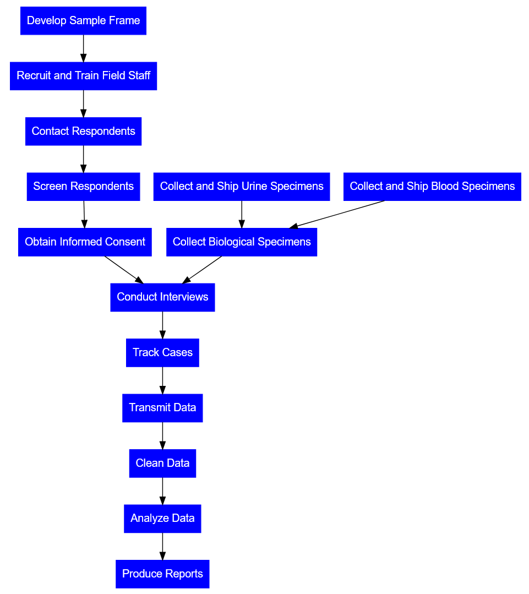

\newpage


# Introduction

The National Survey on Drug Use and Health (NSDUH) is a yearly survey that reports statistical data on alcohol, tobacco, drug use, mental health, and other health-related issues in the United States, representing most of the general population. The NSDUH’s scope includes the civilian population aged 12 and older in the United States; however, it excludes people on active duty in the military, residents of institutions, and people who are homeless and not in shelters.

Through the United States Substance Abuse and Mental Health Services Administration, the NSDUH, or some version of it, has been running since 1971. Over the years, there have been significant changes to the structure and methodology over the years, including taking a larger sample size, updating the questionnaire to reflect modern medical understandings, or using web interviews as well as in-person interviews (a measure taken in response to the COVID-19 pandemic). These changes make it so only certain years’ data are cross-compatible, limitations that are expanded upon further in the documentation.

The dataset is intended to provide a reliable statistical survey of substance use and mental health in the United States, measured per-year (not longitudinally). Substance use topics cover an individual’s past use, across their lifetime, past-year, and past-month, as well as age at first use, perceived need for treatment and substance use treatment history, and substance use disorders. Additionally, interviewees are surveyed about their perception of risks associated with drug use, problems they’ve experienced resulting from drug use, and potentially protective factors, such as drug prevention programs. The NSDUH also covers certain mental health topics, specifically an interviewee’s history of major depressive episodes, suicidal ideation and attempts, mental illness symptoms and diagnoses, and access to and use of mental health care (@datafiles_doc).

The NSDUH provides up-to-date information on tobacco, alcohol, and drug use, mental health and other health-related issues in the United States. Information from the NSDUH is used to support prevention and treatment programs by identifying groups at high risk for substance use and misuse, monitor substance use trends, estimate the need for treatment and inform public health policy. This data is used by institutions such as government agencies, private organizations, individual researchers, and the public at large to use the data for a number of purposes such as those listed above. For example, the U.S. Department of Health and Human Services and state health agencies use the data to estimate the need for treatment facilities (@nsduh_rti). Other federal, state, and local agencies use the information to support prevention programs and monitor drug control strategies.

# Methodology

## Accessing the Data

The data is available online with heavy levels of documentation and a thorough codebook. Additionally there is an web based statistical analysis tool created on the SAMHDA (Substance Abuse and Mental Health Data Archive) site available [here](https://pdas.samhsa.gov/#/) (@samhda). More detailed tables can be found on the SAMHSA site [here](https://www.samhsa.gov/data/report/2021-nsduh-detailed-tables) (@detailed_tables). All of the tables can be downloaded in a zip file which contains both an html and PDF file containing every table. Alternatively, consumers can use the hyperlinked Table of Contents to go to particular sections.

\newpage

## Data Collection


```{r, include = FALSE}
# The output of DiagrammeR isn't compatible with PDF output
# So we screenshotted it with HTML output, then inserted it as an image
# Code is included for replication

library(DiagrammeR)

grViz("digraph data_collection {
   	 node [fontname = Arial, shape = rectangle, color = Blue, style = filled, fontcolor = White];
 
  develop_sample_frame[label = 'Develop Sample Frame'];
  recruit_and_train_field_staff[label = 'Recruit and Train Field Staff'];
  contact_respondents[label = 'Contact Respondents'];
  screen_respondents[label = 'Screen Respondents'];
  obtain_informed_consent[label = 'Obtain Informed Consent'];
  conduct_interviews[label = 'Conduct Interviews'];
  collect_biological_specimens[label = 'Collect Biological Specimens'];
  collect_and_ship_urine_specimens[label = 'Collect and Ship Urine Specimens'];
  collect_and_ship_blood_specimens[label = 'Collect and Ship Blood Specimens'];
  track_cases[label = 'Track Cases'];
  transmit_data[label = 'Transmit Data'];
  clean_data[label = 'Clean Data'];
  analyze_data[label = 'Analyze Data'];
  produce_reports[label = 'Produce Reports'];
 
  develop_sample_frame -> recruit_and_train_field_staff;
  recruit_and_train_field_staff -> contact_respondents;
  contact_respondents -> screen_respondents;
  screen_respondents -> obtain_informed_consent;
  obtain_informed_consent -> conduct_interviews;
  conduct_interviews -> track_cases;
  collect_biological_specimens -> conduct_interviews;
  collect_and_ship_urine_specimens -> collect_biological_specimens;
  collect_and_ship_blood_specimens -> collect_biological_specimens;
  track_cases -> transmit_data;
  transmit_data -> clean_data;
  clean_data -> analyze_data;
  analyze_data -> produce_reports;
}")
```

{width=66%}


The data collection process involves trained community outreach interviewers who perform computer-assisted interviews to collect data on various topics such as substance use, mental health, and treatment.

Following the rigorously detailed 376-page field interviewer manual’s instructions, the field interviewers survey the cases that are assigned to them, using a systematic and random sampling method (@field_manual). Before starting their day, the interviewer performs a weekly inventory check using the NSDUH Materials and Inventory Tracking Form to ensure that they have all the necessary materials for their outreach work. They store their materials in one location and use an expandable wallet with divided sections for storing their materials. The interviewer also carries a laptop bag to store materials and computer equipment.

The interviewer’s daily routine involves heavy preparation before going out to the field. Using their tablet, they coordinate which cases are assigned to them. They develop and review their plan of action, which involves using various features on their tablets such as the Record of Calls (ROC), Call Distribution, View and Sort features, and calendar to help plan their travel routes in detail.

The interviewers also carefully follow the necessary steps for each situation and document their progress using the ROC on their tablet. They review their cases to determine if any need to be placed on hold, if they have questions with those cases, and prepare to transmit their data from their tablet and laptop. Additionally, the NSDUH field interviewer website provides project messages to ensure the accuracy and integrity of the data collected. Before finishing their day, the interviewer completes administrative entries as a record of their work. The interviewer’s role is crucial and ensures the collection of accurate and reliable data for NSDUH (@field_manual).

### Data Commensurability

Commensurability in this case ensures a common measure for understanding and analyzing the rates of drug consumption at different identities such as age. This allows for a better close analysis of the collected data that is cohesive and clear.

Questions were grouped according to the DSM-5’s categories, such that questions about substances in one DSM-5 category were grouped together on the survey, and so on (@codebook). For example, all of the questions relating to tobacco use were asked first, followed by questions about alcohol, then marijuana, etc; each of these categories are one of the substance categories in the DSM-5 (@dsm5). Other categories (such as age) were modeled after previous NSDUH surveys, which originally took inspiration from the US census (@dsm5_abstract). Measurements were taken from interviews with subjects and recorded precisely by interviewers. The dataset is commensurate with common values.

## Sources and Institutions

RTI International (also known as Research Triangle Institute), a third-party research company, has been collecting data for the NSDUH since 1988. Due to the COVID-19 pandemic, the NSDUH project management at RTI worked closely with SAMHSA, RTI’s Infectious Disease Response Team, Executive Leadership Team, and Institutional Review Board in 2021 to determine when and where it would be safe to conduct in-person data collection. In the meantime they worked online. All web-based data collection activities were coordinated by in-house management staff, whereas in-person data collection activities were coordinated by both in-house and remote management staff. For in-person data collection, RTI maintained a field staff of approximately 550 FIs. A total final sample of 69,850 interviews (on the full analytic data file) was obtained for the 2021 survey (@nsduh_rti).

RTI’s work is funded mostly from government grants to pursue their research and mission to “improve the human condition by turning knowledge into practice” (@rti_mission). The questionnaires were formed based on DSM-5 criteria (@dsm5_slides).

## Data Dissemination

NSDUH data is disseminated through various channels, including annual reports and briefs that summarize the findings from the survey. The reports cover a wide range of topics related to substance use and mental health, such as trends in drug use, substance use disorders, mental health issues, and co-occurring disorders. The data is also disseminated through online databases, data visualization tools, and other interactive platforms that allow users to explore the data in more detail. Additionally, restricted-use data files are available for researchers who meet certain requirements and agree to abide by strict data confidentiality and security protocols.

## Assumptions and Potential Biases

The values and assumptions that are built into the NSDUH dataset reflect the priorities and perspectives of the organizations and individuals involved in the survey. The survey focuses on substance use and mental health issues that are deemed to be of public health importance.

The survey asked questions based on a set of assumptions about the nature of substance use and mental health, such as the idea that drug use is a problem that needs to be addressed through prevention and treatment efforts. One example of a potentially biased question was “During the past 12 months have you participated in an alcohol, tobacco or drug prevention program outside of school, where you learn about the dangers of using, and how to resist using, alcohol, tobacco, or drugs?” (@codebook, pg 433), which itself references the “dangers” of using drugs. Questions like this are based on the assumption that drugs are dangerous, and are framed in a way that could influence the interviewee to answer differently.

The survey also assumes that respondents are providing accurate information about their substance use and mental health when answering. The NSDUH dataset is a valuable source of information about substance use and mental health in the United States. It is also important to understand the external factors that can affect the survey results and to consider the values and assumptions that underlie the survey questions and methodology. By approaching the NSDUH data with a critical and nuanced perspective, researchers and policymakers can make more informed decisions about substance use and mental health policies and interventions.

## Limitations: Sampling, Methodology, Missing Information

The NSDUH aims to be a comprehensive study on drug use and health in America, but like all studies, naturally has several limitations. It is non-longitudinal, meaning data across different years cannot be compared. Additionally, though efforts are made to standardize data collection as much as possible, there are still places where data can vary. Finally, there is missing data as well: the study draws samples from certain representative locations, then weights the responses, rather than taking a true random sample across America, which can limit the representativeness of the report.

Methodology changes over different years have made NSDUH data in one year incomparable to data from other years (@datafiles_doc). This limits the commensurability of the data; without being able to compare data from one year to previous years’ data, finding long-term trends in American drug use and health can be much more difficult. Changes to the DSM (notably, the shift from DSM-4 to DSM-5) meant that questions following the DSM-4’s listed criteria were removed in favor of questions following the DSM-5’s criteria (@codebook, pg i-6). This allowed the NSDUH to adapt to contemporary advancements in the science of mental health, but limited data commensurability pre- and post- survey edits.

Even within a specific year’s study and report, there can be inconsistencies in data collection, such as using a mix of web-based interviewing and in-person interviewing because of the COVID-19 pandemic. Web-based responses had slightly lower response rates, and certain questions were omitted due to security issues in web interviews versus in-person interviews (@codebook, pg i-15). Additionally, web-based responses had different demographics than in-person, with a “higher average level of educational attainment than the in-person respondents” (@codebook, pg i-16), possibly because the technological resources to do a web-based interview were more accessible to those with a higher average level of educational attainment. Weights were used to try and balance out these demographic differences in the final report, but the differences still limit the NSDUH’s accuracy as a national representation of mental health and drug use. These inconsistencies lead to poor commensurability both with previous years (that were surveyed wholly in-person) and with data within the same year.

There is also missing information, since NSDUH excludes certain groups of people, leading to an inaccurate reflection of American drug use and health. According to the data collection documentation, the NSDUH excludes “individuals experiencing homelessness who do not use shelters, active military personnel, and residents of institutional group quarters such as jails, nursing homes, mental institutions, and long-term care hospitals” (@data_we_collect), which is a glaring limitation. These individuals are of course still part of the United States, but excluding them may reflect a inaccurate view of America’s drug use and mental health. Although the documentation clearly states that these people are excluded, the majority of laypeople relying on the NSDUH’s reports (such as journalists) will likely not note that in their analyses, influencing a different belief in who the NSDUH represents than is true.

Though the reason for these individuals being excluded is not explicitly listed in the documentation, it’s likely that they were excluded for practical reasons; the additional resources needed to track down an interviewee in any of these three categories are steep on time, energy, and physical resources, and by explicitly excluding them the study makes it easier to regularize the data collection for all other entries, increasing commensurability.

# Reflections and Reactions

Discourse around the NSDUH varies; some authors treat it as a trustworthy source, but other authors are critical of its representativeness of the United States population. Across right-leaning, central-leaning, and left-leaning organizations (political designation as listed by @allsides), authors tend to refer to the NSDUH neutrally, using phrases such as “according to [the NSDUH]” (@article_r_unhappy_teens); this demonstrates an implicit trust in the NSDUH’s data and reports. Relying on the NSDUH to make their points shows that the authors trust its analysis; one article specifically linked the NSDUH to the United States government when introducing it, potentially attempting to increase the reader’s trust in the NSDUH by explicitly writing that it was a government-sponsored work (@article_l_bloomberg).

However, other authors were less accepting, or even critical, of the NSDUH. One author repeatedly referred to the data in the NSDUH as “numbers”, dissociating the data from the institutions that collected it and disseminated it; the same author wrote that the NSDUH “generates state-specific data”, rather than acknowledging that the data is collected, cleaned, and analyzed manually by people (@article_c_pot). This data discourse is pretty typical of other data discourse: Data is often treated as an object unique from the infrastructure supporting its collection and analysis, and this removal from its context helps the author frame the data more as totally neutral, bias-free evidence for whatever their point is. The same author writes, “the National Survey on Drug Use and Health (NSDUH) misses a lot of heroin users”, arguing people that use heroin are reluctant to admit it to NSDUH surveyors, and that underlying factor, compounded by the fact that the NSDUH does not survey prison inmates, leads the NSDUH to dramatically underreport the true proportion of heroin users in the United States (@article_c_heroin). This is a limitation that we noted earlier: By excluding key groups of people, the NSDUH is an unrepresentative report of the national statistics for drug use and mental health.

Thus we see a range of reactions to the NSDUH and its trustworthiness. Contextualizing it in real-world data discourse helps demonstrate that journalists tend to trust the NSDUH, but some have realized the same limitations in its collection methods that we have. The NSDUH is a good resource for understanding the United States population’s drug use and mental health trends, but should not be used as a monolithic source of information; like all datasets, it has its limitations, and realizing where those limitations can impact the results is an important step to learning effectively from the NSDUH.


# Conclusion

The National Survey on Drug Use and Health is a valuable dataset for providing an overview of American drug use and mental health year-by-year. The NSDUH covers an individual’s history of substance use, treatment history, and potential substance use disorders. Interviewees are also surveyed about perceptions of drug use treatment, problems and risks associated with drug use, and drug prevention programs. Additionally, the survey covers several mental health topics, such as major depressive episodes, suicidal ideation and attempts, mental illness symptoms and diagnoses, and access to or use of mental health care.

The NSDUH impacts many other institutions, especially organizations in the medical and healthcare domains. Research is done following insights from the NSDUH, and funding and resources are allocated according to reports from the NSDUH.

Though the dataset is useful, it is still limited in several ways. Sampling is restricted to civilians aged 12 and older in the United States, excluding active-duty military personnel, residents of institutions, and unhoused people not in shelters. Additionally, changes in methodology have affected the long-term commensurability of the data, making it difficult to compare data cross certain years. Expanding sampling would help alleviate these limitations and make the NSDUH a more reliable source of data.

The NSDUH is useful in its domain and influences many other institutions’ work surrounding drug use and mental health. Like most datasets, it has aspects that can be improved. However, when taken in its whole form, it is a trustworthy and reliably-produced source of data that can provide valuable insights into U.S. trends in substance use and mental health.


\newpage


# Bibliography
